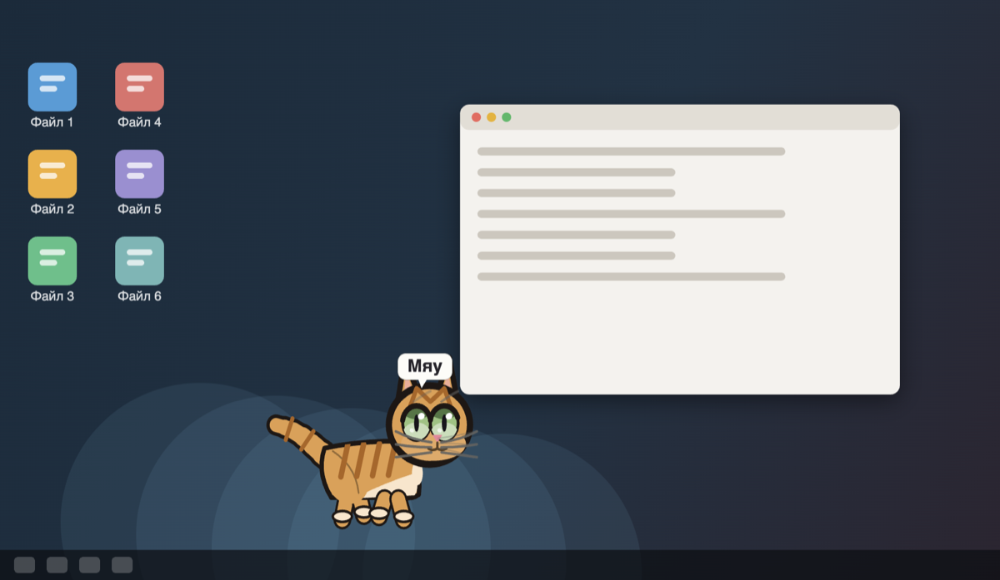
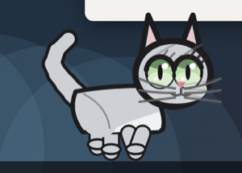
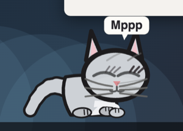
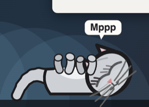
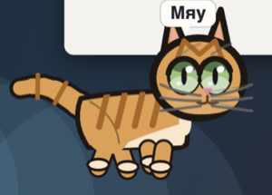
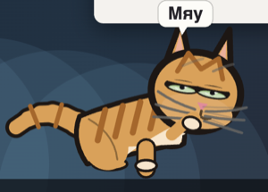
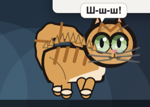
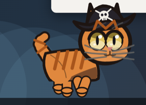
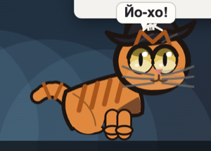
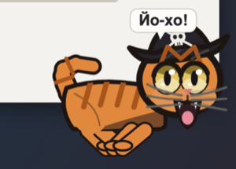

# cat-skill — цифровой кот по фото и описанию

Скилл для Claude: описываешь кота словами или присылаешь фото, получаешь **один HTML-файл**,
в котором нарисованный кодом кот живёт на псевдо-рабочем столе. Никаких картинок и библиотек:
кот рисуется на canvas, файл открывается двойным кликом и работает без сети.



Кот гуляет, следит за настоящим курсором, догоняет его и виснет на нём, лежит буханкой,
спит на спине, умывается, ест из миски, мурчит, когда его гладят, пугается резких движений,
трогает лапой иконки и запрыгивает на них, прячется за окном, а иногда срывается в берсерк.
Голос — текстовые пузыри, звука нет намеренно. Место, пол и число поглаживаний кот помнит
между открытиями файла.

| | | |
|---|---|---|
|  |  |  |
| британская шиншилла | буханка | сон на спине |
|  |  |  |
| Мурзик идёт | умывается | испугался |
|  |  |  |
| Флинт в треуголке | сидит | берсерк |

## Установка

**Claude Code** — как плагин из этого репозитория:

```
/plugin marketplace add Polinavas95/claude-skill-cat
/plugin install cat-skill
```

**Claude.ai** (веб и десктоп) — скачайте [`cat-skill.skill`](cat-skill.skill) и загрузите его
в Settings → Capabilities → Skills → Upload. Администратор организации может включить скилл
для всех.

**Вручную** — скопируйте папку [`plugins/cat-skill/skills/cat-skill`](plugins/cat-skill/skills/cat-skill)
в `~/.claude/skills/`.

## Использование

Скажите Claude что-нибудь вроде:

> Сделай мне цифрового кота: серая британская шиншилла, зелёные глаза, спокойная, любит лежать.

или пришлите фото своего кота и попросите его «оживить». Claude заполнит `cat.json`
и соберёт HTML. Правки («сделай рыжим», «пусть больше спит», «это кошка») — тоже словами.

Схема `cat.json`, палитры окрасов, породы и приметы описаны в
[`pet-spec.md`](plugins/cat-skill/skills/cat-skill/references/pet-spec.md), поведение —
в [`behaviors.md`](plugins/cat-skill/skills/cat-skill/references/behaviors.md).
Готовые примеры — в [`examples/`](examples): три описания и три собранных HTML.

Сборка без Claude, только Python 3.9+:

```bash
python3 plugins/cat-skill/skills/cat-skill/scripts/build_pet.py examples/cats/flint.json -o flint.html
```

## Кот поверх рабочего стола (macOS)

В папке [`cat-pet/`](cat-pet) лежит приложение на Electron: тот же кот, но в прозрачном окне
поверх всех окон. Клики проходят сквозь окно везде, кроме кота; курсор кот видит по всему экрану.
Кот задаётся файлом `cat.json`, правки подхватываются на лету. Подробности — в
[`cat-pet/README.md`](cat-pet/README.md).

```bash
cd cat-pet && npm install && npm run build && npm start
```

## Ограничения

- В HTML-версии кот живёт внутри своего окна: браузер не рисует поверх других окон. Иконки
  и окно на сцене нарисованные.
- В приложении для Mac настоящие иконки коту недоступны: macOS не отдаёт их положение.
- Память кота — localStorage браузера; в другом браузере кот начнёт заново.

## Лицензия

MIT.
